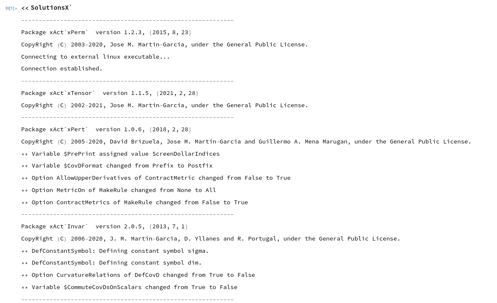
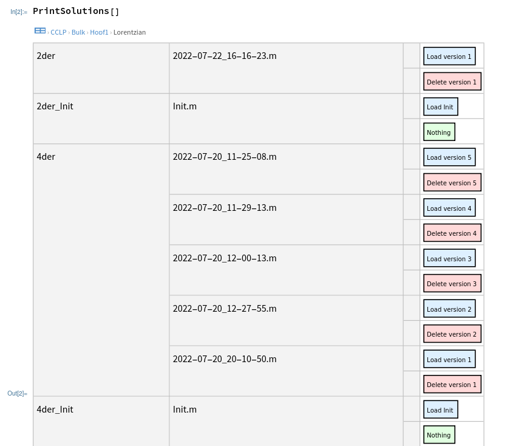
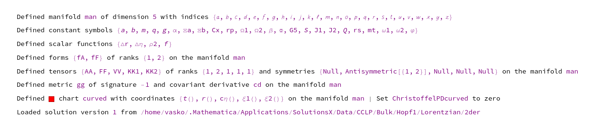
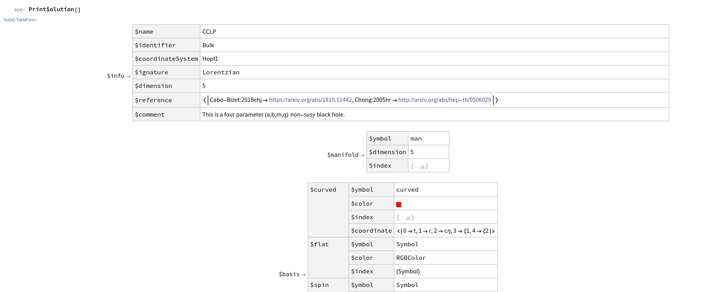
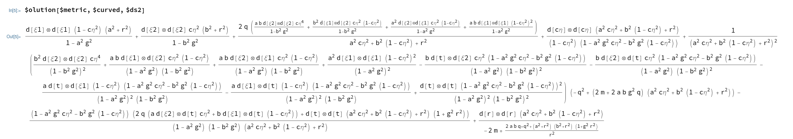
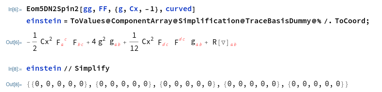

# SolutionsX

This is a Mathematica package based on the xAct suite http://www.xact.es/ and the FieldsX package. It provides the following functionality:
* Fill in the details of a particular field configuration of a particular supergravity theory: (tensors, forms, vielbein, spinors,...)
* Batch functions to calculate the components of all tensors (with curved, flat and/or spin indices) using incredibly fast [^fast] parallel computations, based on the `TensorValues` framework of xAct [^xAct_differences]
* Check equations of motion and BPS explicitly in coordinates
* Store many solutions in a database, such that they can easily be retrieved and used later on
* Ability to add tensors and other data on top of an existing and verified solution
* Ability to quickly change coordinates from one solution to another (only on the level of differential forms, currently)

If you are interested in contributing a solution to the database, email me at vasildimi@gmail.com : )

## 1. Installation instructions

### 1.1. One-off installation

1. Determine your installation directory
   * In a new Mathematica notebook run `FileNameJoin[{$UserBaseDirectory, "Applications"}]`. The result is the installation directory where you will be placing files
2. Install xAct
   * Download the `xAct_version.tgz` (Linux/Mac) or the `xAct_version.zip` (Windows) archive from http://www.xact.es/
   * Unzip it in the installation directory you determined above. The result should be something like:
```
Applications
└───xAct
|   └───xTensor
|   └───xCoba
|   └───xCore
|   └───...
```
3. Install FieldsX
   * Download the `Multisets.m` file from https://library.wolfram.com/infocenter/MathSource/8115/ and place it inside the `Applications` folder (not inside the `xAct` folder) [^common_problem]
   * Download the archive of the code of FieldsX by clicking on the green button `Code` and then `DownloadZIP` from https://github.com/mfroeb/FieldsX
   * Unzip the archive and place the file `FieldsX.m` inside the xAct folder. The result should be something like:
```
Applications
└───xAct
|   └───xTensor
|   └───xCoba
|   └───xCore
|   └───FieldsX.m
|   └───...
└───Multisets.m
```
4. Install SolutionsX
   * Download the archive of the code of SolutionsX by clicking on the green button `Code` and then `DownloadZIP` from https://github.com/waskou/SolutionsX
   * Unzip it inside the installation directory `Applications` and rename the folder to `SolutionsX` (instead of `SolutionsX-main`). The end result should be something like:
```
Applications
└───xAct
|   └───xTensor
|   └───xCoba
|   └───xCore
|   └───FieldsX.m
|   └───...
└───Multisets.m
└───SolutionsX
|   └───Data
|   └───Documentation
|   └───Generator
|   └───Kernel
|   └───...
```
5. Enjoy
   * In a new Mathematica notebook run ``<<SolutionsX` ``. That loads the package and you are set to use its functions and database

### 1.2. Continuous updates installation

1. Follow steps 1-3 above
2. From the terminal go to the `Applications` directory and type `git clone https://github.com/waskou/SolutionsX.git`. That clones the repository in your `Applications` directory and should create the folder structure outlined above, with the difference that in the `SolutionsX` folder there is now also a hidden `.git` folder.
3. Go to `https://github.com/waskou/SolutionsX.git` and click on `Watch` with the setting `All Activity` (or choose your own notifications settings) to be instantly notified when there has been an update in the code or in the database.
4. Everytime you see an update that you want to pull open a terminal, navigate to the `SolutionsX` folder and type `git pull https://github.com/waskou/SolutionsX.git main`. That pulls the most recent version of the code and the database to your local `SolutionsX` folder

## 2. Getting started

To get started open a new Mathematica notebook and run ``<<SolutionsX` ``. That loads the required xAct packages and SolutionsX and a large print appears:



To load a solution from the database the easiest way is to run `PrintSolutions[]`. That generates an interactive dataset table, from where you can navigate and explore the available solution. Choose a solution you like and click `Load version 1` [^versions]. Two things happen when you do that. First, an association https://reference.wolfram.com/language/guide/Associations.html called `$olution` gets populated with the solution data. Second, the xAct environment gets prepared (the manifold, the tensors, the bases,... are defined). You also get a print message like this one:





To explore the solution you have just loaded run `Print$olution[]`. That gives you an interactive dataset of the association `$olution`. The universal keys are usually prefixed by `$`. For example, the metric is returned when you run `$olution[$metric,$curved,$ds2]`:




To check equations of motion, you call something like `Eom<nameOfTheEquation>`. For example, `EomD5N2spin2[gg,FF,{g,Cx},curved]` gives back the Einstein equation of $D = 5$, $\mathcal{N} = 2$, minimal gauged supergravity [^naming]. Then you can convert this into an array of expression using `ToValues@ComponentArray@TraceBasisDymmy@%`. Hitting this  with `Simplify` should return an array filled with zeroes if the inputted solution satisfies the Einstein equation:


## 3. Contributing a solution

1. Email me on vasildimi@gmail.com, and I can give you rights to push your own solutions to the database or modifying the code in a different branch. Depending on interest, I might setup some quality control before your contributed solutions get uploaded.

[^fast]: On the CCLP black hole example that I have most thoroughly tested this code the parallel computation of the curvature tensors (Christoffels, Riemann, Ricci,... with various configurations of up and down components) takes less than 2 hours on my laptop to `FullSimplify`. I have not been able to achieve that using other tools.

[^xAct_differences]: Nowadays xAct provides similar functionality based on th `CTensor` framework, when it comes to the metric and its derived tensors (Christoffels, Riemann, Ricci,...). However, I personally found it difficult to extend the parallel code that the developers of xAct have provided to the case of tensors with indices on other vector bundles, such as the spin or the flat bundle. I will be very interested if anyone can show me a way to do that.

[^common_problem]: For some browsers and/or operating systems when you click on the download button for `Multisets.m` it actually saves the file with a `.nb` extension. If that is the case for you, simply rename it to have a `.m` extension before placing it in `Applications`.

[^versions]: The versioning acts like a sort of a backup, with version 1 the newest version. Currently, I have set it up that it stores up to 5 version, rewriting them at subsequent saves.

[^naming]: If when creating the solution `gg` is the symbol used to denote the metric tensor, `FF` --- the symbol of the field strength tensor, `g` --- the inverse AdS scale, `Cx` --- a constant to account for different conventions for the gauge field in various papers, `curved` --- the symbol that is used to name the curved basis in xAct.